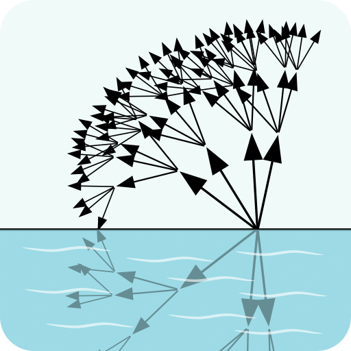

<p align="center">

</p>

# trie-match

`trie-match` is a command-line tool that finds intersections of string tries,
supporting a simple pattern syntax.

Think of it as a specialized `grep`, with multiple patterns and optimized for
shared prefixes.

## Example

For these two input files

```console
$ cat patterns.txt
foo.**.bar	pattern 1
foo.*.baz.*	pattern 2

$ cat queries.txt
foo.bar	query 1
foo.baz	query 2
foo.hello.baz.world	query 3
```

we find two matches:

```console
$ trie-match -p patterns.txt -q queries.txt
foo.hello.baz.world	foo.*.baz.*	query 3	pattern 2
foo.bar	foo.**.bar	query 1	pattern 1
```

(Note that the input and output use tabs as column separators.)

The search avoids repeating prefix matches, so `foo` is only matched once. This
makes the search more efficient than pair-wise matching for large inputs.

## Installation

### Using Nix

`flake.nix` provides a package and devshell, so `nix run`, `nix shell` and
`nix develop` are all supported.

```sh
nix shell github:cebamps/trie-match
```

### Using Cabal

A Cabal file is provided.

```sh
cabal install
```

Ensure that GHC and Cabal are properly set up before using this method. More
details can be found at [Haskell.org](https://www.haskell.org/get-started/).

This should work under GHC 9.6, 9.8, and 9.10 at least.

### Using Docker

A Docker file is provided. It supports an optional `GHC_VERSION` build arg.

```sh
docker build -t trie-match .
```

## Usage

```console
$ trie-match --help
Usage: trie-match (-p|--pattern FILENAME) (-q|--query FILENAME) [-x|--prefix]
                  [-w|--wide-globs]

  Find intersections of string tries efficiently, based on shared prefixes.

Available options:
  -p,--pattern FILENAME    pattern file
  -q,--query FILENAME      query file
  -x,--prefix              interpret patterns as prefixes
  -w,--wide-globs          globs at the boundaries of segment patterns may
                           consume neighbouring segments
  -h,--help                Show this help text
```

## Matching Details

The input files list their patterns and queries list in the form of **input
lines**.

An input line consists of a pattern (or query) expression, followed by an
optional tab character and arbitrary string annotation.

A **pattern expression** is a string representation of a pattern, with segments
separated by dots. Segments may not contain dots, tabs, or line breaks. The
segment language consists of:

- **Star** (`**`) - Matches zero or more query segments.
- **Plus** (`*`) - Matches one or more query segments.
- **Glob** (any other valid segment) - Matches one query segment, where `*` acts
  as a wildcard for zero or more characters.

A **query expression** follows the same structure but consists only of **literal
segments**, which are plain text segments where `*` has no special meaning.

A pattern and query **match** (or **intersect**) when the pattern matches the
query.

`trie-match` outputs one line per query-pattern intersection, optionally
followed by the annotation for the query and pattern annotations, all separated
by tabs. That is, the format of each output line is:

```ebnf
OutputLine ::= Query "\t" Pattern ("\t" QueryAnn ("\t" PatternAnn)?)?
```

That format is suitable to be processed by [`cut` from coreutils][cut] or by
[Miller] invoked as [`mlr -T`][mlr-T].

[cut]: https://www.man7.org/linux/man-pages/man1/cut.1.html
[Miller]: https://miller.readthedocs.io/
[mlr-T]:
  https://miller.readthedocs.io/en/latest/reference-main-flag-list/#format-conversion-keystroke-saver-flags

### Pattern modifiers

Extra options are supported (see Usage) to alter the meaning of patterns.

- `--prefix` effectively makes each pattern match queries by prefix, by ensuring
  it ends in `.**` or `.*`, implicitly appending `.**` if needed. For example,
  the pattern `foo` will match the query `foo.bar` only with `--prefix`.

- `--wide-globs` makes asterisks (`*`) in glob segments capture zero or more
  neighbouring segments. For example, `foo*.qux` will match `foobar.baz.qux`,
  but `b*z` will _not_ match `bar.baz`.

While the patterns are implicitly modified in the process, the output still
shows the original patterns from the input file.

## Running Tests

Tests are executed via Cabal:

```sh
cabal test
```

## Caveats

The code remains scrappy. Small units are tested but the program as a whole is
not.

While annotations in the input are allowed to contain tabs, this can make their
delimitation ambiguous in the output.

Performance may become an issue in the presence of chains of segments like
`*.*.*` due to combinatorial explosion, similar to regex. Note however that
simplifications are applied where patterns are strictly equivalent, for example
`**.*` to `*`.

When a file contain duplicate entries, only the last annotation will be kept.

Pattern modifiers `--prefix` and `--wide-globs` may cause further duplication of
patterns, which will not only clobber the first instances' annotations but also
the patterns themselves. For example, if patterns `foo` and `foo.**` are present
in that order and `--prefix` is used, `foo` will never be reported as a match
because it internally becomes `foo.**` and is clobbered by the latter.
Nevertheless, no query match is lost.
