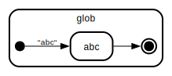
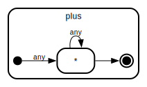
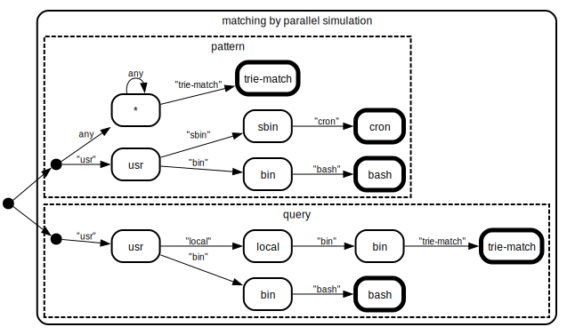

_Disclaimer:_ I am not particularly well-versed in CS. There may be some
inaccuracies in my language (written or visual).

# Matching

This documentation illustrates how patterns and queries are turned into NFAs,
similar to regex constructions.

## NFA construction

With this simple pattern language, the construction is simpler than it is for
regex however. A segment produces exactly one state, so we can name it after
that segment for clarity.

The NFA is built from small pieces derived from the segments.

### Glob



### Plus (`*`)



### Star (`**`)


### Composition

The compositional pieces of pattern segments are pieced together into a pattern
NFA by joining initial and final states. For example:


Since we structure our patterns and queries into tries, prefixes may be shared
in the NFA, resulting in a tree structure. For example, for the two patterns
`**.x` and `**.y`:


**Note:** In these NFA diagrams, we leave out the transitions to a final
failure state. It is understood that the state at the end of each branch should
transition to a failure state on any further input (in addition to the usual
self-transition for `*` and `**`). For example, the NFA for `x` should reject
the two-token input `(x, y)`, though the NFA for `*` should still accept it.

## Matching

Matching consists in simulating the NFAs for pattern and query in parallel. We
seek to find the set of pairs of accepting states that can be reached by any
input.

For example, consider these inputs:

```console
$ cat patterns.txt
*.trie-match
usr.sbin.cron
usr.bin.bash

$ cat queries.txt
usr.local.bin.trie-match
usr.bin.bash
```

The NFAs are built and run as follows, where accepting states are represented in
bold, meaning they correspond to a full input line having been processed.



The intersection is found to be the two query-pattern pairs
`usr.bin.bash - usr.bin.bash` and `usr.local.bin.trie-match - *.trie-match`,
after receiving input tokens `(usr, bin, bash)` and
`(usr, local, bin, trie-match)` respectively.
